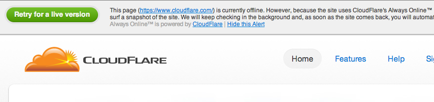

Cloudflare

    - [login to Cf](https://www.cloudflare.com/login)
    - [login to WMT](https://www.google.com/webmasters/tools/home)
    - Open complex controller 

      `e /Users/mat/work/vulnerable_app/app/controllers/pages_controller.rb`

What is Cloudflare?

    ### They make the web faster and safer

    - Started out as a security service
    - They put themselves in front of your web services
    - Once that was done, they realized they could do much more

What is Cloudflare? 

    - Start at the beginning
    - At its simplest: DNS service

What is Cloudflare? 

    - When you "enable Cloudflare" the magic starts
      - Security
      - Speed optimizations
      - Downtime mitigation
      - Cloudflare apps

How it works: 
Reverse proxy

    - All traffic goes through them.
    - Lets them do a bunch of stuff for you, while you keep your backend simple.
    - let's not get ahead of ourselves.

Per hostname

<pre> www.mysite.com
 sub.mysite.com</pre>

    - All features can be enabled for www
    - Only used as a DNS service for sub

What can they do?

    Let's dig into what they can do

Security

    - Make SSL easy
    - WAF
    - DoS protection (denial of service)
    - Email obfuscation
    - server side exclude
    - Captcha (for suspect visitors)
    - Image hotlinking protection

Speed optimizations

    - CDN
    - Web Content Optimization (Rocket L, img optim, gzip)
    - SPDY (http replacement)
    - Railgun (will come back to it)

Traffic analytics

    - Real traffic vs crawlers vs attackers
    - Page views, all hits, bandwidth
    - download their logs

Other smart stuff

    - Always On
    - Geolocation header
    - Cloudflare apps
    - IPV6 support

How expensive? 
<pre>
0$ (and more)
</pre>

  - DNS
  - Speed: CDN, some WCO (Rocket Loader)
  - Security: basic threat protection
  - Analytics: yesterday and before
  - Smart stuff: Always On (7 days), Geolocation header, Cloudflare apps

I'm serious

  <pre><li>Pro: 20$, then +5$ (ssl)</li>
  <li>Biz: 200$ (cust ssl)</li>
  <li>Ent: "Call us" (3000$+) (logs)</li></pre>

 in action

  Let's look at Cloudflare in action

Geolocation 

  Geolocation is IP based and gives you the country of the originating request

Caching

  - Show [www](www.rsrlabs.com) and [direct](direct.rsrlabs.com)
  - Clear browser cache
  - Observe the network requests
  - Rocket Loader hasn't kicked in yet, traffic too low
  - [Show complex Rails action for home page]

Forced caching

  - despite what your backend says about HTTP caching
  - helps mitigate conf problems, sudden popularity, DoS, etc
  - [show conf](https://www.cloudflare.com/page-rules?z=rsrlabs.com)

Flexible SSL

  - Cheapest paid plan 20$
  - SSL between visitor and Cloudflare
  - HTTP between Cloudflare and your server
  - [Go to https version of the site]
  - Solves first-mile security problems
    - E.g. Firesheep
  - Super easy to set up
  - Can be set per url with page rules

Your cert 

    Not self-signed, though

Cloudflare app

  - Add [Google Webmaster tools](https://www.google.com/webmasters/tools/home?hl=en)
  - [Cf apps](https://www.cloudflare.com/cloudflare-apps?z=rsrlabs.com)
  - [Go to Websites / rsrlabs.com's Apps]

App for Google Analytics

  - Never forget tracking code in new templates again
  - Enabled on any subdomain (main, blog, microsites, landing pages)
  - Including external sites
  - [help.rsrlabs.com](http://help.rsrlabs.com)
      - Be careful with that

Lots of apps

  Scroll down the [List](https://www.cloudflare.com/cloudflare-apps?z=rsrlabs.com)

Cloudflare requests

  - Let's inspect web requests. direct vs cloudflare
  - [cf](http://www.rsrlabs.com/headers)
  - [direct](http://direct.rsrlabs.com/headers)
  - IP_CFCOUNTRY
  - scheme (for Flexible SSL)

Analytics

  - [Visit Dashboards](https://www.cloudflare.com/analytics)
  - Regular vs Crawlers vs Threats
  - Views vs Hits vs Bandwidth
  - Show threat control

WAF 

  - Mitigates security problems like recent Rails vulnerabilities
  - known problems like SQLi, path traversal, etc
  - Blocks the noise of the internet

Always Online 

  ...

Railgun 

  - 99.6% compression of dynamic pages
  - Facebook feed, NY Times home page
  - agent local to you
  - comm their internal network (CDN)
  - ships diff of page
  - often fits in 1 TCP packet
  - Business acct or Cf opt partner

Setting it up

  - DNS only: point your registrar there
  - Restore original IP if Cloudflare enabled (optional), since it's a reverse proxy
  - Apache module or small nginx snippet

 Not for everyone

  - Cf has outages
  - if too reliant on those niceties, turning Cf off during their outages can prove disastrous
  - if your clients CNAME to you (cf off)
  - All ur traffic are belong to them (cf on)

Gripes

  - site navigation can be confusing
  - ex: I didn't think you could do hostname redirects, but you can with page rules
  - DNS saves on Ajax, not form submit
  - Missing: DNSimple's ALIAS record
    - New site: scan existing records
    - Useful if trf ex site
    - Annoying when setting up new site (some cleanup to do, can't cancel)

Future

  - load balancing

Try it!

  - free SL is awesome
  - give enormous power & flexibility to startups moving at breakneck speed
  - so easy: saves time & money even for simplest sites: side projects, blog, microsites

?

 - Show around dashboard?

webmat 
(gmail, twitter, github)

  - Consultant: Rails & DevOps
  - Hard stuff
  - scaling
  - big migrations
  - infra automation
  - custom monitoring
  - coaching or implementation
  - rescue projects

DevOps? 
devopsmtl.com

  [devopsmtl](http://devopsmtl.com)
