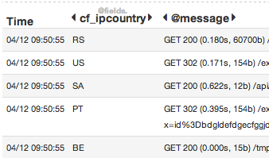
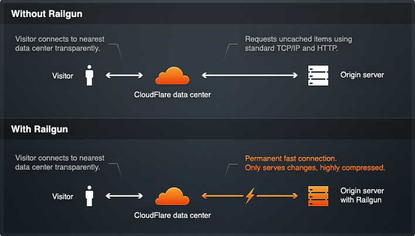

Cloudflare

    ### They make the web faster and safer

    - [login to Cf](https://www.cloudflare.com/login)
    - [login to WMT](https://www.google.com/webmasters/tools/home)

What is Cloudflare? 

    - Started out as a security service
    - They put themselves in front of your services
    - Once that was done, they realized they could do much more
    - ...
    - At its simplest: DNS for your online service

What is Cloudflare? 

    - When you "enable Cloudflare" the magic starts
      - Speed optimizations
      - Security
      - Downtime mitigation
      - Cloudflare apps

How it works:
Reverse proxy

    - All traffic goes through them.
    - Lets them do a bunch of stuff for you, while you keep your backend simple.
    - let's not get ahead of ourselves.

Per hostname

<pre> www.mysite.com
 sub.mysite.com</pre>

    All features can be enabled for www
    Only used as a DNS service for sub

What can they do?

  ...

Security

    - SSL
    - WAF
    - DoS protection
    - Email obfuscation
    - server side exclude
    - Captcha
    - Hotlink protection

Speed optimizations

    - CDN
    - Web Content Optimization (rocket l, img optim, gzip)
    - SPDY (http replacement)
    - Railgun

Traffic analytics

    - Real traffic vs crawlers vs attackers
    - download detailed logs

Other smart stuff

    - Always On
    - Geolocation header
    - Cloudflare apps
    - IPV6 support

How expensive? 
<pre>
0$+
</pre>

  - DNS
  - Speed: CDN, some WCO (Rocket Loader)
  - Security: basic threat protection
  - Analytics: last 30 days, starting yesterday
  - Smart stuff: Always On, Geolocation header, Cloudflare apps

I'm serious

  <pre><li>Pro: 20$, then +5$ (ssl)</li>
  <li>Biz: 200$ (cust ssl)</li>
  <li>Ent: Call us (3000$+) (logs)</li></pre>

Serious uses

  Let's talk about some of the interesting things

Geolocation 

  Geolocation is IP based and gives you the country of the originating request

Cloudflare in action

  - Open www.rsrlabs.com and direct.rsrlabs.com
  - Observe the network requests
  - Notice:
    - cached requests
    - optimized assets
    - SPDY?

Force caching

  - despite what your backend says about HTTP caching
  - helps mitigate conf problems, sudden popularity, dos, etc

Flexible SSL

  - Cheapest paid plan 20$
  - SSL between visitor and Cloudflare
  - HTTP between Cloudflare and your server
  - Solves first-mile security problems
      - E.g. Firesheep
  - Super easy to set up
  - [Go to https version of the site]

Or your cert 

    Not self-signed, though

Cloudflare app

  - Add [Google Webmaster tools](https://www.google.com/webmasters/tools/home)
  - [My Websites](https://www.cloudflare.com/my-websites)
  - [Go to Websites / rsrlabs.com's Apps]

App for Google Analytics

  - Never forget tracking code in new templates again
  - Enabled on any subdomain
  - Including external sites
  - [help.rsrlabs.com](http://help.rsrlabs.com)
      - Be careful with that

Lots of apps

  [List](https://www.cloudflare.com/cloudflare-apps?z=rsrlabs.com)

Cloudflare requests

  - Let's inspect web requests. direct vs cloudflare
  - [cf](http://www.rsrlabs.com/inspect)
  - [direct](http://direct.rsrlabs.com/inspect)

Analytics

  - [Analytics](https://www.cloudflare.com/analytics)
  - Regular vs Crawlers vs Threats
  - Views vs Hits vs Bandwidth
  - Show threat control

WAF 

  - Mitigates security problems like recent Rails vulnerabilities
  - known problems like SQLi, path traversal, etc
  - Blocks the noise of the internet

Railgun 

  - 99.6% compression of dynamic pages
  - Facebook feed, NY Times home page
  - agent local to you, comm their int network to get only diff of page
  - often fits in 1 TCP packet
  - Business acct or Cf opt partner

Setting it up

  - DNS only: point your registrar there
  - Restore original IP if Cloudflare enabled (optional), since it's a reverse proxy
  - Apache module or small nginx snippet

Not for everyone

  - Cf has outages
  - if too reliant on those niceties, turning Cf off during their outages can prove disastrous
  - if your clients CNAME to you (cf off)
  - All ur traffic are belong to them (cf on)

Gripes

  - DNS saves on Ajax, not form submit
  - Missing: DNSimple's ALIAS record, Zerigo's host redirect.
  - When entering new site, try to scan existing records. Useful if trf ex site. Annoying when setting up new site (some cleanup to do)

Future

  - load balancing

Try it!

  - free SL is awesome
  - give enormous power & flexibility to startups moving at breakneck speed
  - so easy that it'll save you time & money for simplest sites: side projects, blog, microsites

?

 - Show around dashboard?

webmat 
<pre>
(gmail, twitter, github)
</pre>

  - Consultant: Rails & DevOps
  - Scaling, infra automation, best practices, coaching & implementation, rescue.

DevOps?
<pre>
devopsmtl.com
</pre>

